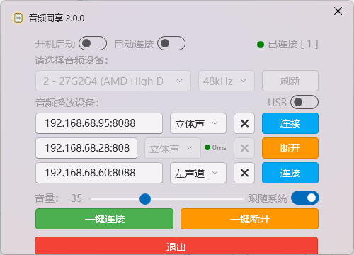

# AudioShare - Real time sharing of Windows audio to Android devices

English | [简体中文](./README.md)

AudioShare is an application that allows you to transfer real-time sound from your Windows computer to Android devices for playback. It supports multiple Android devices to connect simultaneously and can play different sounds according to different channels. You can connect your device through a USB data cable or Wi Fi network.

## Features

+ Real time transmission: Real time transmission of sound from Windows computers to Android devices with low latency and high sound quality.
+ Multi device support: Supports multiple Android devices to connect simultaneously, and can play different sounds according to different channels.
+ Multi-channel support: Captures audio in the actual channel layout of the system output device (2.0/2.1/5.1/7.1, etc.). Each playback device can be assigned any channel (front left/right, center, LFE, surround, back) to build a distributed surround system.
+ LAN device discovery: Playback devices on the LAN are discovered automatically at startup in Wi-Fi mode, and can also be found instantly via the "Search Devices" button.
+ Multi-device sync: Network latency is measured per device and compensated automatically; playback is re-aligned on every track change, with a manual "Audio Sync" button for immediate correction.
+ Two connection methods: supports USB data cable and Wi Fi network connection.
+ Remote control: supports remote control of playing cloud music, using the Musiche project, and supports NetEase Cloud, QQ, and Migu music playback.
+ Multi machine interconnection: supports synchronous playback of multiple devices during remote playback, which can be disabled or enabled in the settings interface.
+ One-click operation: Connect or disconnect all devices at once, with auto-connect on startup.
+ Low latency optimization: Uses WASAPI low-latency capture on Windows and low-latency audio output on Android.

## User Guide

### Windows

1. Download AudioShare.exe and AudioShare.apk from the [Release Page](https://github.com/Kezry/OpenAudioShare/releases/latest). For USB connections, also download adb.exe, AdbWinApi.dll, AdbWinUsbApi.dll.
2. Open AudioShare.exe application.
3. Choose connection method:
   + USB: Connect the Windows computer and Android device to the same USB cable.
   + Wi-Fi: Ensure that Windows computers and Android devices are connected to the same Wi Fi network.
4. USB Connection: Select the device from the "USB Device" dropdown menu, and then click the "Connect" button.
5. Wi-Fi Connection: Enter the IP address and port number of the Android device (default port number is 8088), and then click the "Connect" button (Windows will automatically discover Android devices on the local area network when using Wi-Fi connection, and you can also use the "Search Devices" button for an instant scan).
6. After a successful connection, you can hear the sound of your Windows computer on your Android device.

### Android Device

1. If possible, you can manually install the app to an Android device (Windows will try to install it when unable to connect).
2. If manually installed, you can open the app to view the remote management address and Windows remote connection address.
3. If you are using a USB connection, please wait for the application to automatically install.
4. If you are using a Wi Fi connection, make sure that your Windows computer and Android device are connected to the same Wi Fi network.
5. After a successful connection, you can hear the sound of your Windows computer on your Android device.

## Advanced

### Connect/Disconnect All

The "Connect All" and "Disconnect All" buttons at the bottom of the Windows app allow you to connect or disconnect all devices at once.

### Auto Connect

Enable the "Auto Connect" toggle to automatically connect all saved devices when the software starts.

### Multi-channel Output (2.1/5.1/7.1)

1. Configure the output device to the desired channel layout (e.g. 5.1, 7.1) in the Windows sound settings; the app captures audio in the device's actual channel layout.
2. In the Windows device list, choose which channel each Android playback device plays: Stereo, Front Left/Right, Center, LFE, Surround Left/Right, Back Left/Right/Center.
3. For example, when watching a 5.1 movie, four devices can act as Center, Front Left, Front Right and LFE to form a distributed home theater.

### Audio Sync

When multiple devices play simultaneously, the app measures each device's network latency and compensates for the difference, and re-aligns automatically on every track change. If you still notice drift during playback, click the "Audio Sync" button to correct it immediately.

### Phicomm R1 atmosphere light

1. Authorize the app to obtain Android root privileges.
2. It takes effect after restarting the app.
3. Multiple devices can synchronize atmosphere lighting effect.

### Remote control for playing cloud music

1. Access the remote management address displayed in the upper left corner of the Android app interface, with a default port of 8080 (Phicomm R1 is 8090).
2. Open the remote management page and select to log in to NetEase Cloud, QQ, or Migu Music accounts in the settings interface to view personal playlists.
3. Detailed introduction can be found in [Musiche project](https://github.com/HeHang0/Musiche).

### Multi interconnection

1. Install the AudioShare app on multiple Android devices.
2. After opening the AudioShare application on all devices, it will automatically discover local area network devices and connect them
3. By default, it will automatically connect and synchronize playback. If you need to disable the multi machine interconnection function, you can turn it off in the settings interface.

### Download

+ [Latest Release](https://github.com/Kezry/OpenAudioShare/releases/latest)
